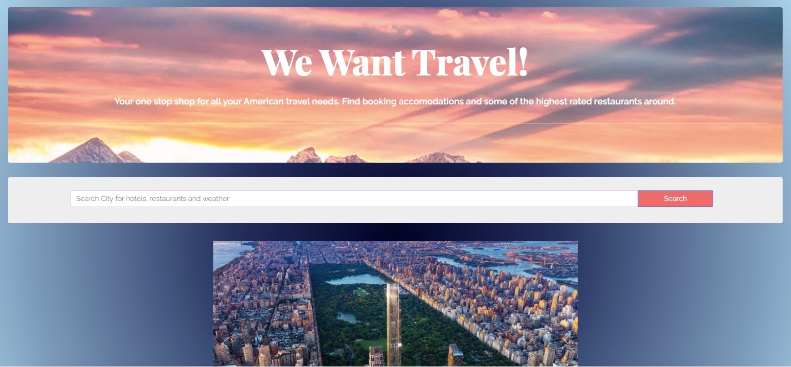

# group-project-1
## Title of app:
We Want Travel! 

## List of technologies used:
    HTML, CSS, Javascript, Jquery, Bootstrap, GoogleFonts, 
    API's:
    openweathermap, yelp via heroku, hotels.com via rapidApi

Comprehensive travel page that let's the user enter a city they want to visit and renders Hotel options, Restaurant options and a 5 day forecast. Yelp API needs work, as of now on first use user has to go to console and click on heroku link to request access. 

## Contact information 
Chelsey Morris:
    email: chelseymorris91@yahoo.com
    github: github.com/cmorris91
    linkedIn: https://www.linkedin.com/in/chelsey-morris-758590204/

Sharon: 
    github: github.com/sharon1106

Tim Morse:
     github: github.com/timmorse13

# Links
Deployed:
https://cmorris91.github.io/group-project-1/
Repo:
https://github.com/cmorris91/group-project-1

#Photos

`